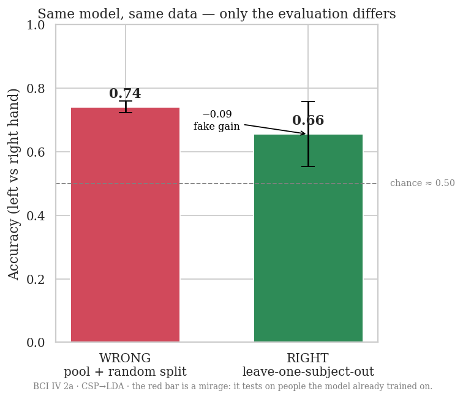
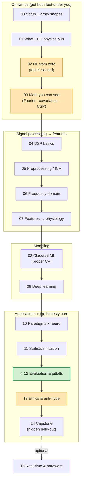

# ML & Signal Processing on Neural Signals 101 (Python)

[](https://github.com/ChiShengChen/neural-signals-101/actions/workflows/ci.yml)
[](LICENSE)
[](https://www.python.org/downloads/release/python-3110/)
[](https://colab.research.google.com/github/ChiShengChen/neural-signals-101/blob/main/notebooks/00_setup_and_data.ipynb)

**English** · [繁體中文](README.zh-TW.md)

> Go from **raw brain recordings → preprocessing → features → models → an honest
> score**, entirely through runnable Jupyter notebooks. **Built for university
> students new to neuro-AI/ML** — you only need basic Python. We assume **no** prior
> machine learning *and* no neuroscience: every term is defined on first use, the
> maths is shown visually (no proofs), and there's a [glossary](docs/GLOSSARY.md)
> and a [troubleshooting guide](docs/TROUBLESHOOTING.md) for when you get stuck.

The single most important thing this tutorial teaches is **how not to fool
yourself**. For a beginner that starts earlier than you'd think: reading a number
without knowing what it means, wiring an array shape wrong and trusting the garbage,
or believing a hyped headline. We build those reflexes first (Chapters 02, 03, 11),
*then* tackle the subtle one — **data leakage** — that makes most "amazing"
brain-decoding results collapse when reproduced (Chapter 12). Over-claiming to the
public is its ethical twin (Chapter 13).

> 📚 New here? See [`docs/CURRICULUM.md`](docs/CURRICULUM.md) for the full learning
> design and rationale.

---

## What you'll be able to do

- Load real public datasets **by code** (nothing to download by hand).
- Filter, denoise (ICA), and epoch EEG correctly.
- Build time-, frequency-, connectivity-, **CSP**- and **Riemannian** features.
- Train classical models **and** deep nets (EEGNet, ShallowConvNet, DeepConvNet,
  LSTM, a tiny Transformer) — all on a **laptop CPU in minutes**.
- Evaluate **honestly**: no leakage, subject-independent headline metric,
  mean ± std, the right metric for imbalance.

---

## A taste of the big idea

Here is the one habit this whole tutorial builds toward. Both bars below come from
the **same model on the same brain data** — the *only* difference is **how the score
was measured**:



- 🔴 **Red bar** — data from many people is mixed together and split *randomly*, so the
  model is quietly tested on the very people it learned from. It looks great… and it's a
  mirage.
- 🟢 **Green bar** — the model is tested only on people it has **never seen**. Lower, but
  **honest** — this is the number that survives the real world.

**Don't worry if this doesn't fully click yet** — building the intuition for *why* the
red bar lies is exactly what the early chapters are for. By Chapter 12 you'll be able to
spot **six different ways** that red bar sneaks into real projects (and how to avoid each).

---

## Install

**Fastest (no install):** click the **Open in Colab** badge above (or on any chapter in
the table below) and run the first cell — a free cloud Python environment, nothing to
set up. Great for a first look; see [`docs/GETTING_STARTED.md`](docs/GETTING_STARTED.md).

**Locally** (recommended for repeated use) — requires **Python 3.11** and ~3 GB of free
disk for cached datasets:

```bash
git clone https://github.com/ChiShengChen/neural-signals-101 && cd neural-signals-101
make setup        # creates a Python 3.11 .venv and installs everything (CPU-only torch)
source .venv/bin/activate
```

No `make`? The manual equivalent:

```bash
python3.11 -m venv .venv && source .venv/bin/activate
pip install torch==2.4.1 --index-url https://download.pytorch.org/whl/cpu
pip install -r requirements.txt
pip install -e .
```

Then launch the notebooks:

```bash
jupyter notebook notebooks/   # or: make run-all   to execute them all headless
```

> **Reproducing the headline figure:** `make headline` (downloads BCI IV 2a on
> first run, ~0.2 GB/subject, then writes `docs/headline.png`).

---

## How to use this tutorial

> 🚀 **Never opened a Jupyter notebook, or not sure your Python is ready?** Start with
> [`docs/GETTING_STARTED.md`](docs/GETTING_STARTED.md) — including a one-click
> **Run-on-Colab** path (no install) and a 5-question Python self-check.
> Helpful tabs to keep open: [Glossary](docs/GLOSSARY.md) ·
> [FAQ](docs/FAQ.md) ("is my score good?") · [Cheat sheet](docs/CHEATSHEET.md) ·
> [Troubleshooting](docs/TROUBLESHOOTING.md).

- **Work through the notebooks in order** (`notebooks/00_*` → `15_*`). Each one is
  self-contained, opens with **learning objectives** + a **prerequisite/difficulty**
  box, has explanatory markdown between every code step, **"predict-before-run"**
  cells, at least one **visualization**, a **✅ concept check**, and a closing
  **"⚠️ Common mistakes / why this is wrong"** cell.
- **Every ⚠️ cell is wrong on purpose.** It exists to show you a trap and the
  resulting fake-high score — never copy a ⚠️ cell into real work.
- **The shared code lives in `src/neuro101/`** and is imported by every notebook
  (and covered by tests). The evaluation helpers there — `make_subject_split`,
  `make_block_split`, `leakage_safe_pipeline`, `evaluate_with_variance` — are the
  guard rails that make honest evaluation the path of least resistance.
- **Everything runs on CPU in ~5 minutes per notebook.** Data is subsampled and we
  always tell you when. Set `NEURO101_SMOKE=1` to use the smallest slices.

### Learning paths

| If you are… | Suggested path |
|---|---|
| **A total beginner** (the design target) | Do **00 → 14 in order**. Chapter 15 is an optional appendix. |
| **Comfortable with ML, new to signals** | Skim **02**, do **03**; focus **01, 04–07, 10, 12, 13**. |
| **Comfortable with neuro, new to ML** | Skim **01**; do **02, 03, 11**; focus **04–09, 12**. |

**Everyone reads Chapter 12 (evaluation pitfalls) and Chapter 13 (ethics & anti-hype)** —
they are the point of the whole tutorial.

---

## 🗺️ The map



*Amber = beginner on-ramps · green = the chapter the whole tutorial builds toward.*

## Chapters (with estimated runtime)

| # | Notebook | What it covers | Diff | First-run time* |
|---|---|---|---|---|
| 00 | [Setup & data](notebooks/00_setup_and_data.ipynb) | Ecosystem, file formats, load & plot data, **the array-shape mental model** | ★ | ~3–5 min |
| 01 | [What neural signals are](notebooks/01_what_are_neural_signals.ipynb) | EEG physical origin, volume conduction, 10-20 system, where the noise is | ★★ | ~1 min |
| 02 | [**ML from zero**](notebooks/02_ml_from_zero.ipynb) 🆕 | Overfitting, train/val/test, *why the test set is sacred* (toy data, no EEG) | ★★ | ~1 min |
| 03 | [**Math you can see**](notebooks/03_math_you_can_see.ipynb) 🆕 | Fourier, covariance, eigenvectors/CSP geometry — visual, no proofs | ★★★ | ~1 min |
| 04 | [DSP basics](notebooks/04_dsp_basics.ipynb) | Sampling, aliasing, quantization, filters, notch, referencing | ★★★ | ~1 min |
| 05 | [Preprocessing & denoising](notebooks/05_preprocessing_and_denoising.ipynb) | Artefacts, ICA, ASR-style cleaning, epoching, baseline | ★★★ | ~1–2 min |
| 06 | [Frequency domain](notebooks/06_frequency_domain.ipynb) | FFT, Welch PSD, STFT, wavelets, band power, time–freq trade-off | ★★★ | ~1 min |
| 07 | [Feature engineering](notebooks/07_feature_engineering.ipynb) | Features **tied to physiology** (ERD/ERS), CSP, Riemannian covariance | ★★★★ | ~1–2 min |
| 08 | [Classical ML](notebooks/08_classical_ml.ipynb) | LDA/SVM/RF/Riemann via Pipelines, **proper cross-validation** | ★★★ | ~2–3 min |
| 09 | [Deep learning](notebooks/09_deep_learning.ipynb) | EEGNet, ShallowConvNet, DeepConvNet, LSTM, tiny Transformer | ★★★★ | ~3–5 min |
| 10 | [Paradigms & applications](notebooks/10_paradigms_and_applications.ipynb) | MI, P300/ERP, SSVEP, sleep, seizure, brain-to-text — **why each works** | ★★★ | ~2–3 min |
| 11 | [**Statistics intuition**](notebooks/11_statistics_intuition.ipynb) 🆕 | Sampling variation, mean±std, chance≠1/k, "a small gap is noise" | ★★★ | ~1–2 min |
| 12 | [**Evaluation & pitfalls**](notebooks/12_evaluation_and_pitfalls.ipynb) ⭐ | Six WRONG→RIGHT pairs; the most important chapter | ★★★★ | ~2–4 min |
| 13 | [**Neuroethics & anti-hype**](notebooks/13_neuroethics_and_anti_hype.ipynb) 🆕 | Privacy, consent, neuro-rights, "offline 95% ≠ a BCI", hype = leakage's twin | ★★ | ~1 min |
| 14 | [Capstone](notebooks/14_capstone.ipynb) | Raw → honest report vs a **hidden held-out leaderboard** | ★★★★ | ~2–4 min |
| 15 | [Real-time & hardware](notebooks/15_realtime_and_hardware.ipynb) 🆕 | Simulated streaming inference + a low-cost hardware path (OpenBCI/Muse) | ★★ | ~1–2 min |

\*First run downloads & caches data; later runs are much faster. Every chapter has a
prerequisite + difficulty box, "predict-before-run" cells, and a ✅ concept-check.
Extra exercises with answers: [`docs/SOLUTIONS.md`](docs/SOLUTIONS.md).

---

## Datasets (all public, all auto-downloaded by code)

| Dataset | Used for | Approx. download |
|---|---|---|
| **MNE sample** (MEG+EEG) | First plots, ERPs (Ch 00) | ~1.5 GB (skipped in CI/smoke mode) |
| **BCI Competition IV 2a** (motor imagery, via MOABB) | Headline + Ch 07–14 | ~0.2 GB per subject (9 subjects) |
| **PhysioNet EEG Motor Movement/Imagery** | Ch 00, 01, 05 (light demos) | ~40 MB per subject |
| **Sleep-EDF** (polysomnography) | Sleep staging & imbalance (Ch 10, 12) | ~8 MB per recording |

Downloads are cached in `~/neuro101_data` (override with the `NEURO101_DATA`
environment variable). See `src/neuro101/datasets.py` for the full registry and
`neuro101.datasets.describe()` for a printable summary.

---

## Repository layout

```
README.md                LICENSE (MIT)   CONTRIBUTING.md   requirements.txt   Makefile
src/neuro101/   io.py preprocessing.py features.py viz.py eval.py datasets.py   (importable, tested)
notebooks/      00_setup … 15_realtime  (.ipynb, built from notebooks/_src/*.py)
tests/          pytest for src/ + a smoke test that every notebook executes
scripts/        make_headline_figure.py  build_notebooks.py  run_all_notebooks.py
docs/           headline.png  CURRICULUM.md  GETTING_STARTED.md  GLOSSARY.md
                FAQ.md  CHEATSHEET.md  TROUBLESHOOTING.md  SOLUTIONS.md
.github/workflows/ci.yml  (pytest + notebook smoke test on push)
```

---

## The hard rules (enforced in code, not just prose)

This repo is opinionated so that honesty is the default:

1. **No random-shuffle splits on time series — ever.** We only provide
   `make_subject_split` (Leave-One-Subject-Out) and `make_block_split`
   (trial/block-aware), and use them everywhere.
2. **All learned preprocessing is fit on train only**, via sklearn `Pipeline`
   (`leakage_safe_pipeline`).
3. **Subject-independent results are the headline**; subject-dependent ones are
   labelled "optimistic".
4. **Everything is seeded and CPU-friendly** (`<~5 min` per notebook).
5. **Variance is always reported** (`evaluate_with_variance` → mean ± std).

---

## Development

```bash
make test        # unit tests + a fast (smoke-mode) notebook execution test
make test-fast   # unit tests only, no downloads
make lint        # ruff
make run-all     # execute every notebook end-to-end (full data)
```

Tests include **soul-guards** (`tests/test_pitfalls.py`) that assert the WRONG→RIGHT
contrasts of Chapter 12 still hold — so a refactor can't silently break the point of
the tutorial. CI (`.github/workflows/ci.yml`) runs lint + unit tests + a notebook smoke
test on every push.

See [CONTRIBUTING.md](CONTRIBUTING.md) to add a chapter or a feature, and
[`docs/CHEATSHEET.md`](docs/CHEATSHEET.md) for the one-page API + evaluation checklist.

## License

[MIT](LICENSE). Educational use encouraged — please share it.
