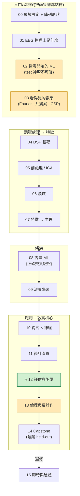

# 神經訊號的機器學習與訊號處理 101(Python)

[](https://github.com/ChiShengChen/neural-signals-101/actions/workflows/ci.yml)
[](LICENSE)
[](https://www.python.org/downloads/release/python-3110/)
[](https://colab.research.google.com/github/ChiShengChen/neural-signals-101/blob/main/notebooks/zh-TW/00_setup_and_data.ipynb)
[](https://nbviewer.org/github/ChiShengChen/neural-signals-101/tree/main/notebooks/zh-TW/)

[English](README.md) · **繁體中文**

> 📓 **Notebook 在 GitHub 上無法預覽?** GitHub 的 notebook 算繪器偶爾會抽風。改用
> **[nbviewer](https://nbviewer.org/github/ChiShengChen/neural-signals-101/tree/main/notebooks/zh-TW/)**
> 開啟(它一定能用),或點上方徽章用 Colab 執行。

> 從**原始腦波紀錄 → 前處理 → 特徵 → 模型 → 誠實的評分**,全程透過可執行的 Jupyter
> notebook 學會。**專為神經 AI/ML 入門大學生設計**——你只需要基本的 Python。我們**不**
> 預設你會機器學習,也**不**預設你懂神經科學:每個術語第一次出現時都會解釋,數學用
> 視覺化呈現(不證明),卡住時還有[詞彙表](docs/zh-TW/GLOSSARY.md)和
> [疑難排解](docs/zh-TW/TROUBLESHOOTING.md)。

這份教學最重要的一件事,是教你**如何不自我欺騙**。對初學者來說,自我欺騙比你想的更早
發生:看著一個數字卻不知道它代表什麼、把陣列形狀(array shape)接錯卻深信不疑的垃圾
輸出、或是被誇大的新聞標題騙。我們先建立這些反射(第 02、03、11 章),**接著**才處理
那個最隱微的——**資料洩漏(data leakage)**,它讓多數「驚人的」腦波解碼結果在重現時
崩潰(第 12 章)。對大眾過度宣稱(over-claim),則是它的倫理孿生(第 13 章)。

> 📚 第一次來?完整的學習設計與理念見 [`docs/CURRICULUM.md`](docs/zh-TW/CURRICULUM.md)。

---

## 你將學會什麼

- 用**程式碼**載入真實的公開資料集(完全不用手動下載)。
- 正確地對 EEG 做濾波、去雜訊(ICA)與切分 epoch。
- 建立時域、頻域、連結性(connectivity)、**CSP** 與 **Riemannian** 特徵。
- 訓練古典模型**以及**深度網路(EEGNet、ShallowConvNet、DeepConvNet、LSTM、一個小型
  Transformer)——全部都能在**筆電 CPU 上幾分鐘內**完成。
- **誠實地**評估:無洩漏、以受試者獨立(subject-independent)為頭條指標、回報
  mean ± std、對類別不平衡用對的指標。

---

## 先嚐一口核心觀念

這是整份教學最終要培養的那個習慣。下面兩根長條來自**同一個模型、同一批腦波資料**——
*唯一*的差別是**分數怎麼量出來的**:


- 🔴 **紅色長條**——把很多人的資料混在一起後*隨機*切分,於是模型其實被拿去測試它
  「學過的同一群人」。看起來很漂亮……但那是海市蜃樓。
- 🟢 **綠色長條**——模型只在它**從沒看過的人**身上測試。分數較低,卻**誠實**——這才是
  能在真實世界存活的數字。

**現在看不太懂沒關係**——搞懂紅色長條*為什麼*會騙人,正是前面幾章要鋪陳的。到第 12 章
你就能認出紅色長條偷溜進真實專案的**七種不同方式**(以及各自怎麼避免)。

---

## 安裝

**最快(免安裝):** 點上方(或下方章節表中任一章)的 **Open in Colab** 徽章,執行第一個
cell——一個免費的雲端 Python 環境,什麼都不用裝。適合先試玩;細節見
[`docs/GETTING_STARTED.md`](docs/zh-TW/GETTING_STARTED.md)。

**本機安裝**(重複使用時較推薦)——需要 **Python 3.11** 與約 3 GB 可用磁碟空間(快取
資料集用):

```bash
git clone https://github.com/ChiShengChen/neural-signals-101 && cd neural-signals-101
make setup        # 建立 Python 3.11 的 .venv 並安裝所有東西(CPU-only torch)
source .venv/bin/activate
```

沒有 `make`?手動等價步驟:

```bash
python3.11 -m venv .venv && source .venv/bin/activate
pip install torch==2.4.1 --index-url https://download.pytorch.org/whl/cpu
pip install -r requirements.txt
pip install -e .
```

接著啟動 notebook:

```bash
jupyter notebook notebooks/   # 或:make run-all   讓它們全部在背景執行
```

> **重現頭條圖:** `make headline`(第一次會下載 BCI IV 2a,每位受試者約 0.2 GB,然後
> 寫出 `docs/headline.png`)。

---

## 怎麼使用這份教學

> 🚀 **從沒開過 Jupyter notebook、或不確定自己的 Python 夠不夠?** 先看
> [`docs/GETTING_STARTED.md`](docs/zh-TW/GETTING_STARTED.md)——包含一鍵**在 Colab 執行**(免
> 安裝)的路徑,以及 5 題 Python 自我檢測。
> 建議隨時開著的分頁:[詞彙表](docs/zh-TW/GLOSSARY.md) ·
> [FAQ](docs/zh-TW/FAQ.md)(「我的分數算好嗎?」)· [速查表](docs/zh-TW/CHEATSHEET.md) ·
> [疑難排解](docs/zh-TW/TROUBLESHOOTING.md)。

- **依序做完所有 notebook**(`notebooks/00_*` → `15_*`)。每一章都能獨立運作,開頭有
  **學習目標** + **前置/難度**框,程式碼步驟之間有解說 markdown、**「先猜再跑」**cell、
  至少一張**視覺化**、一個 **✅ 觀念檢查**,以及結尾的
  **「⚠️ 常見錯誤 / 為什麼這樣錯」**cell。
- **每個 ⚠️ cell 都是故意寫錯的。** 它的存在是為了示範陷阱與隨之而來的假高分——
  絕對不要把 ⚠️ cell 複製到真實工作中。
- **共用程式碼放在 `src/neuro101/`**,被每個 notebook 匯入(且有測試覆蓋)。其中的評估
  工具——`make_subject_split`、`make_block_split`、`leakage_safe_pipeline`、
  `evaluate_with_variance`——是讓「誠實評估」成為阻力最小路徑的護欄。
- **每個 notebook 都能在 CPU 上約 5 分鐘內跑完。** 資料有做子抽樣,而且我們一定會告訴
  你。設 `NEURO101_SMOKE=1` 可使用最小的資料切片。

### 學習路徑

| 如果你是… | 建議路徑 |
|---|---|
| **完全初學者**(設計的目標讀者) | **00 → 14 依序做**。第 15 章是選修附錄。 |
| **熟 ML、不熟訊號** | 略讀 **02**、做 **03**;聚焦 **01、04–07、10、12、13**(+ [deep-dives](deep-dives/zh-TW/)）。 |
| **熟神經、不熟 ML** | 略讀 **01**;做 **02、03、11**;聚焦 **04–09、12**。 |
| **只想學誠實評估**(救你的論文） | **02** → **08** → **11** → **⭐12** → [`deep-dives/stats_rigor`](deep-dives/zh-TW/stats_rigor.ipynb)。 |

**所有人都該讀第 12 章(評估陷阱)與第 13 章(倫理與反炒作)**——它們是整份教學的重點。想要更深?
**[deep-dives/](deep-dives/zh-TW/)** 資料夾是進階天花板(CSP 幾何、Riemannian 數學、統計嚴謹度、
**是腦還是假影?**、**遷移/領域適應**、FBCSP、模型可解釋性、真實 P300/SSVEP…),屬選修支線,
不受「5 分鐘 CPU」限制。

---

## 🗺️ 地圖



*琥珀色 = 入門起跑線 · 綠色 = 整份教學所要抵達的那一章。*

## 章節(含預估執行時間)

| # | Notebook | 內容 | 難度 | 首次執行時間* |
|---|---|---|---|---|
| 00 | [環境設定與資料](notebooks/zh-TW/00_setup_and_data.ipynb) | 生態系、檔案格式、載入與繪圖、**陣列形狀心智模型** | ★ | ~3–5 分 |
| 01 | [神經訊號是什麼](notebooks/zh-TW/01_what_are_neural_signals.ipynb) | EEG 物理來源、volume conduction、10-20 系統、雜訊在哪 | ★★ | ~1 分 |
| 02 | [**從零開始的 ML**](notebooks/zh-TW/02_ml_from_zero.ipynb) 🆕 | 過擬合、train/val/test、*為何 test 神聖不可碰*(玩具資料,無 EEG) | ★★ | ~1 分 |
| 03 | [**看得見的數學**](notebooks/zh-TW/03_math_you_can_see.ipynb) 🆕 | Fourier、共變異、特徵向量/CSP 幾何——視覺化,不證明 | ★★★ | ~1 分 |
| 04 | [DSP 基礎](notebooks/zh-TW/04_dsp_basics.ipynb) | 取樣、aliasing、量化、濾波器、notch、re-reference | ★★★ | ~1 分 |
| 05 | [前處理與去雜訊](notebooks/zh-TW/05_preprocessing_and_denoising.ipynb) | 假影、ICA、ASR 式清理、epoching、baseline | ★★★ | ~1–2 分 |
| 06 | [頻域](notebooks/zh-TW/06_frequency_domain.ipynb) | FFT、Welch PSD、STFT、wavelet、band power、時頻權衡 | ★★★ | ~1 分 |
| 07 | [特徵工程](notebooks/zh-TW/07_feature_engineering.ipynb) | **接回生理**的特徵(ERD/ERS)、CSP、Riemannian 共變異 | ★★★★ | ~1–2 分 |
| 08 | [古典 ML](notebooks/zh-TW/08_classical_ml.ipynb) | LDA/SVM/RF/Riemann 用 Pipeline、**正確的交叉驗證** | ★★★ | ~2–3 分 |
| 09 | [深度學習](notebooks/zh-TW/09_deep_learning.ipynb) | EEGNet、ShallowConvNet、DeepConvNet、LSTM、小型 Transformer | ★★★★ | ~3–5 分 |
| 10 | [範式與應用](notebooks/zh-TW/10_paradigms_and_applications.ipynb) | MI、P300/ERP、SSVEP、睡眠、癲癇、brain-to-text——**為何有效** | ★★★ | ~2–3 分 |
| 11 | [**統計直覺**](notebooks/zh-TW/11_statistics_intuition.ipynb) 🆕 | 抽樣變異、mean±std、chance≠1/k、「小差距其實是雜訊」 | ★★★ | ~1–2 分 |
| 12 | [**評估與陷阱**](notebooks/zh-TW/12_evaluation_and_pitfalls.ipynb) ⭐ | 七組 WRONG→RIGHT 對照(含 nested CV);最重要的一章 | ★★★★ | ~2–4 分 |
| 13 | [**神經倫理與反炒作**](notebooks/zh-TW/13_neuroethics_and_anti_hype.ipynb) 🆕 | 隱私、consent、neuro-rights、「offline 95% ≠ 能用的 BCI」、炒作=洩漏的孿生 | ★★ | ~1 分 |
| 14 | [Capstone](notebooks/zh-TW/14_capstone.ipynb) | 原始資料 → 誠實報告,對上**隱藏 held-out 排行榜** | ★★★★ | ~2–4 分 |
| 15 | [即時與硬體](notebooks/zh-TW/15_realtime_and_hardware.ipynb) 🆕 | 模擬串流推論 + 低成本硬體路徑(OpenBCI/Muse) | ★★ | ~1–2 分 |

\*首次執行會下載並快取資料;之後快很多。每章都有前置 + 難度框、「先猜再跑」cell、以及
✅ 觀念檢查。附解答的額外習題:[`docs/SOLUTIONS.md`](docs/zh-TW/SOLUTIONS.md)。

---

## 資料集(全部公開、全部用程式碼自動下載)

| 資料集 | 用途 | 約略下載量 |
|---|---|---|
| **MNE sample**(MEG+EEG) | 首批繪圖、ERP(第 00 章) | ~1.5 GB(smoke/CI 模式會略過) |
| **BCI Competition IV 2a**(運動想像,經 MOABB) | 頭條 + 第 07–14 章 | 每位受試者 ~0.2 GB(共 9 位) |
| **PhysioNet EEG 運動動作/想像** | 第 00、01、05 章(輕量示範) | 每位受試者 ~40 MB |
| **Sleep-EDF**(多項睡眠生理) | 睡眠分期與不平衡(第 10、12 章) | 每筆紀錄 ~8 MB |

下載會快取在 `~/neuro101_data`(可用 `NEURO101_DATA` 環境變數覆寫)。完整登錄表見
`src/neuro101/datasets.py`,或執行 `neuro101.datasets.describe()` 取得可列印的摘要。

---

## 專案結構

```
README.md                LICENSE (MIT)   CONTRIBUTING.md   requirements.txt   Makefile
src/neuro101/   io.py preprocessing.py features.py viz.py eval.py datasets.py   (可匯入、有測試)
notebooks/      00_setup … 15_realtime  (英文;由 notebooks/_src/*.py 產生)
notebooks/zh-TW/  16 本可執行的繁體中文 notebook(由 notebooks/zh-TW/_src/*.py 產生)
deep-dives/     進階支線(CSP 幾何、Riemann、統計嚴謹度…),含 deep-dives/zh-TW/ 繁中版
tests/          src/ 的 pytest + 每個 notebook 都能執行的 smoke test
scripts/        make_headline_figure.py  build_notebooks.py  run_all_notebooks.py
docs/zh-TW/     CURRICULUM.md  GETTING_STARTED.md  GLOSSARY.md  FAQ.md
                CHEATSHEET.md  TROUBLESHOOTING.md  SOLUTIONS.md(全繁中)
.github/workflows/ci.yml  (push 時跑 pytest + notebook smoke test)
```

> 註:繁中 notebook 與 docs 與英文版**程式碼完全相同**,只翻譯教學文字與註解;CI 以英文版為
> 程式碼的真實來源。

---

## 硬規則(用程式碼強制,不只是寫在文件裡)

這個 repo 是有立場的,好讓「誠實」成為預設:

1. **絕不對時間序列做隨機洗牌切分。** 我們只提供 `make_subject_split`
   (Leave-One-Subject-Out)與 `make_block_split`(trial/block 感知),並到處使用它們。
2. **所有會「學習」的前處理只在訓練資料上 fit**,透過 sklearn `Pipeline`
   (`leakage_safe_pipeline`)。
3. **受試者獨立的結果才是頭條**;受試者相依的結果一律標註為「樂觀」。
4. **所有東西都設種子且對 CPU 友善**(每個 notebook `<~5 分鐘`)。
5. **一定回報變異**(`evaluate_with_variance` → mean ± std)。

---

## 開發

```bash
make test        # 單元測試 + 一個快速(smoke 模式)的 notebook 執行測試
make test-fast   # 只跑單元測試,不下載
make lint        # ruff
make run-all     # 用完整資料端到端執行每個 notebook
```

測試包含**靈魂守衛**(`tests/test_pitfalls.py`),會斷言第 12 章的 WRONG→RIGHT 對照仍然
成立——讓重構不會悄悄改壞整份教學的重點。CI(`.github/workflows/ci.yml`)會在每次 push
執行 lint + 單元測試 + notebook smoke test。

新增章節或功能請見 [CONTRIBUTING.md](CONTRIBUTING.zh-TW.md),一頁 API + 評估檢查表見
[`docs/CHEATSHEET.md`](docs/zh-TW/CHEATSHEET.md)。

## 授權

[MIT](LICENSE)。鼓勵教育用途——歡迎分享。
